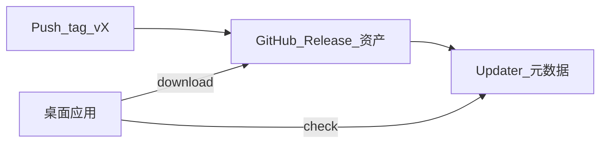

# Tauri 打 tag 后自动构建 + 应用内自动更新

## 结论

**可以做到。** 你当前是 Tauri 2（`[apps/desktop/src-tauri/Cargo.toml](apps/desktop/src-tauri/Cargo.toml)`），已有 tag 触发但**只建 Release 说明、未打安装包**（`[/.github/workflows/release.yml](.github/workflows/release.yml)` 注释里也写了「可追加 tauri build」）。补齐 CI 构建产物 + 官方 updater 插件后，客户端即可检测新版本并走下载安装流程。

## 与「PR」的关系

- 你选择 **tag-only**：合 PR 不会自动发版；发版节奏是 **改版本号 → 打 tag → CI 构建并挂到 Release**。这与「给最终用户自动更新」是匹配的（每个 Release 对应明确版本）。
- 若将来要在 **每个 PR** 出包，可另加 workflow 只上传 `actions/upload-artifact`，**不要**和正式 updater 共用同一通道，避免版本混乱。

## 1. CI：tag 推送时多平台构建并上传 Release

**现状**：`[release.yml](.github/workflows/release.yml)` 在 `ubuntu-latest` 上只跑 `softprops/action-gh-release`，无二进制。

**目标**：

- 使用 **matrix**：至少 `macos-latest`、`windows-latest`（Linux `.deb`/AppImage 视需求再加）。
- 复用与 CI 一致的步骤：checkout → `oven-sh/setup-bun` → `bun install --frozen-lockfile` → `sync:changelog`（或确保 tag 前已同步）→ `packages/sidecar` build → 前端 build → **Tauri 构建**。
- 推荐用官方维护的 `[tauri-apps/tauri-action](https://github.com/tauri-apps/tauri-action)`（需确认当前文档中 Tauri v2 的 `projectPath` / `args` 写法），或自行 `cd apps/desktop && bun run tauri build` 后把 `src-tauri/target/release/bundle/...` 里的产物 `upload` 到同一 Release。
- **版本与 tag 一致**：打 `v0.1.4` 前，需把 `[apps/desktop/package.json](apps/desktop/package.json)`、`[Cargo.toml](apps/desktop/src-tauri/Cargo.toml)`、`[tauri.conf.json](apps/desktop/src-tauri/tauri.conf.json)` 里的 `version` 升为 `0.1.4`（与 tag 去掉 `v` 后一致），否则 updater 比对会乱。

**权限**：`contents: write` 已具备；若用 `tauri-action` 附带创建/更新 Release，需按其文档配置 `releaseId` 或与现有 `action-gh-release` 分工（常见做法是单一 job 用 tauri-action 同时 build+upload，避免两个 action 抢 Release）。

## 2. 应用内自动更新：Tauri 2 updater 插件

**依赖与配置**（按官方 Tauri 2 文档）：

- Rust：`tauri-plugin-updater`，并在 `[lib.rs](apps/desktop/src-tauri/src/lib.rs)` `Builder` 上 `.plugin(tauri_plugin_updater::Builder::new().build())`（具体 API 以文档为准）。
- 前端：`@tauri-apps/plugin-updater`，在设置页（例如 `[SettingsModal.vue](apps/desktop/src/components/SettingsModal.vue)` 关于区域）增加「检查更新」：调用 `check()` / `downloadAndInstall()`，并用 Naive UI 的反馈组件提示进度与重启。
- **Capabilities**：在 `[capabilities/default.json](apps/desktop/src-tauri/capabilities/default.json)` 为 updater 增加对应 `updater:allow-check` 等权限（以插件文档列出的 permission 为准）。

**更新源**：最省事是 **GitHub Releases**（私有仓需 token 策略；公开仓通常可直接用）。`tauri.conf.json` 的 `plugins.updater` 需配置 `endpoints`（指向生成的 `latest.json` 或 GitHub API 兼容端点，以 Tauri 2 当前 schema 为准）。

### 签名是什么？没有「平台证书」能实现么？

日常说的「签名」容易混在一起，这里拆成两层：

| 类型                                                 | 是什么                                                                         | 没有它会怎样                                                                          | 和「本地能打包安装」的关系                                                             |
| -------------------------------------------------- | --------------------------------------------------------------------------- | ------------------------------------------------------------------------------- | ------------------------------------------------------------------------- |
| **操作系统级代码签名**（Apple Developer ID / Windows 代码签名证书） | 向系统证明「这个 .app/.dmg/.exe 来自某个注册开发者」                                          | macOS：他人从网上下载常被 Gatekeeper 拦截，需在「隐私与安全性」里点「仍要打开」，或右键打开；Windows：SmartScreen 可能警告 | **你在本机**用 `tauri build` 出来的包，自己双击、或给信任你的人用，**完全可以不办证书就安装**。本地没有证书 ≠ 不能打包。 |
| **Tauri 更新通道签名**（`TAURI_PRIVATE_KEY` 等）            | 用 `tauri signer generate` **免费生成**的密钥对：给「更新清单 + 安装包」做校验，防止 CDN/GitHub 上包被篡改 | 官方 updater 流程通常**要求**配置这一对（公钥打进应用，私钥只在 CI）；**这不是**买 Apple/微软证书                  | 与「本地能不能装」无关，是**自动更新**安全模型的一部分；具体是否可在无签名模式下仅作开发验证，以 Tauri 2 插件文档为准。        |

**结论**：

- **没有 Apple/微软平台证书**：完全可以实现「CI 出安装包 + 小范围内测 +（在配置好 Tauri 更新密钥的前提下）应用内检查更新」。代价是陌生用户从网络首次安装时系统警告更多，需要说明如何「仍要打开」。
- **本地没有签名也能打包安装**：正常；系统对你本机构建的二进制往往不会像对待「未知来源下载」那样严格。

CI Secrets 方向：`TAURI_PRIVATE_KEY`、`TAURI_KEY_PASSWORD`（更新通道，自建）；若以后要对公网用户友好，再增加 macOS 公证与 Windows 签名相关 secret（`APPLE_`*、证书等）。

## 3. 与 sidecar 的关系

`[tauri.conf.json](apps/desktop/src-tauri/tauri.conf.json)` 已把 `xunji-sidecar` 打进 `bundle.resources`。**完整应用更新**时，新安装包会带上新 sidecar；只要每次发版前 sidecar 构建进同一 pipeline，无需单独更新 sidecar。

## 4. 风险与注意点

- **首版无 updater 的用户**：老包没有 updater 代码时，只能手动下载一次带 updater 的版本。
- **破坏性变更**：数据库迁移等已在 `[migrations.rs](apps/desktop/src-tauri/src/storage/migrations.rs)` 处理；发版仍建议在 CHANGELOG 中说明。
- **changelog 校验**：CI 里有 `sync:changelog` 检查（`[ci.yml](.github/workflows/ci.yml)`）；release workflow 中要么跑同样检查，要么约定发版前在 PR 里已同步。

## 5. 建议实施顺序

1. 扩展 `release.yml`：matrix + sidecar + 前端 + `tauri build`，确认 Release 上出现 `.dmg`/`.msi`（或你需要的 targets）。
2. 生成 Tauri 更新密钥并写入 Secrets；平台证书可后补。本地/CI 用无平台签名先跑通 `tauri build` 与 updater（与最终对外体验分开迭代）。
3. 接入 `tauri-plugin-updater` + `tauri.conf` endpoints + 前端「检查更新」。
4. 用两个连续 tag 做一次端到端：旧版 app 检查更新 → 下载 → 安装重启。

