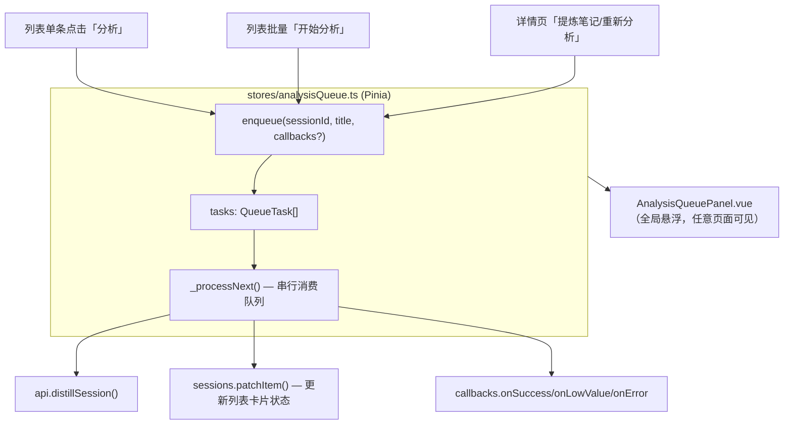
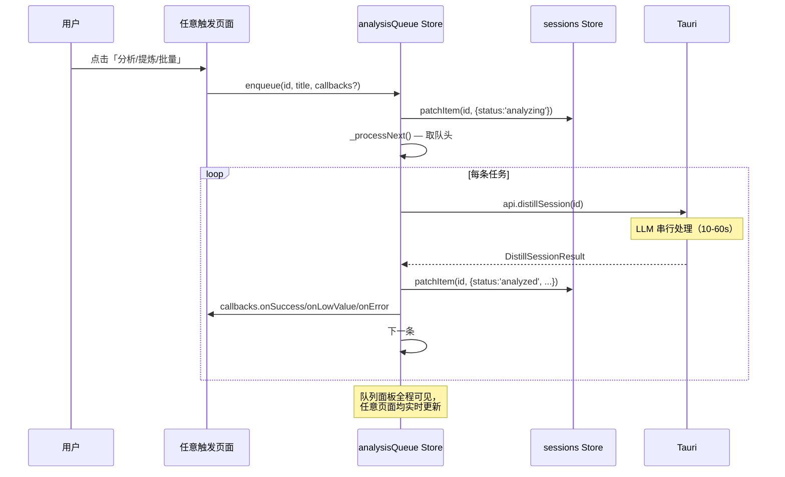

# 全局分析队列 UI

## 架构总览




---

## 文件清单

### 新建：`[src/stores/analysisQueue.ts](apps/desktop/src/stores/analysisQueue.ts)`

**数据结构**：

```typescript
interface QueueTask {
  sessionId: string
  displayTitle: string           // 用于面板展示的会话名称
  status: 'pending' | 'running' | 'done' | 'error'
  outcome?: 'success' | 'low_value'
  elapsedSec: number
  callbacks?: {
    onSuccess?: (r: DistillSessionResult) => void
    onLowValue?: (r: DistillSessionResult) => void
    onError?: (msg: string) => void
  }
}
```

**核心接口**：

- `enqueue(sessionId, displayTitle, callbacks?)` — 入队，若该 sessionId 已在队列中（非 done/error）则跳过；入队后立即调 `sessions.patchItem({ status: 'analyzing' })`（乐观更新），随后调 `_processNext()`
- `cancel()` — 设 `cancelling = true`；将所有 `pending` 任务标为 `error`，并调 `sessions.patchItem({ status: 'pending' })` 还原列表
- `clear()` — 删除所有 `done/error` 任务
- `_processNext()` — 内部私有；取第一个 `pending` 任务，标为 `running`，启动秒计时 `setInterval`，调 `api.distillSession`，完成后更新 task + sessions store + 触发 callbacks，500ms 后递归调自身

**关键 computed**：

```typescript
const currentTask   = computed(() => tasks.value.find(t => t.status === 'running') ?? null)
const pendingCount  = computed(() => tasks.value.filter(t => t.status === 'pending').length)
const totalCount    = computed(() => tasks.value.length)
const doneCount     = computed(() => tasks.value.filter(t => t.status === 'done' || t.status === 'error').length)
const hasAny        = computed(() => tasks.value.length > 0)
```

---

### 新建：`[src/components/AnalysisQueuePanel.vue](apps/desktop/src/components/AnalysisQueuePanel.vue)`

固定在右下角（`fixed bottom-5 right-5 z-50`），仅当 `queueStore.hasAny` 时显示。

**面板布局**（宽约 280px，Transition 淡入）：

```
┌─────────────────────────────────────┐
│  ⚡ 分析队列  已完成 2/5   [×关闭]  │
├─────────────────────────────────────┤
│  ⏳ Vue3 响应式原理…  (已耗时 32s)  │  ← currentTask，spinning
│  ▬▬▬▬▬▬▬░░░░░  40%                 │  ← NProgress
├─────────────────────────────────────┤
│  ✅ Rust 错误处理最佳实践           │
│  ✅ tokio async 并发模型            │  ← 最近完成（最多显示 3 条）
│  ❌ SQLite FTS5 查询优化            │
├─────────────────────────────────────┤
│  ⏸ 等待中 (3 条)        [停止分析] │  ← 仅当有 pending 时
└─────────────────────────────────────┘
```

- "×关闭" 仅当所有任务完成后出现（调 `queueStore.clear()`），进行中时不可关闭
- "停止分析" 调 `queueStore.cancel()`，取消后变为"×关闭"
- `analyzeSlow`（耗时 > 150s）时在当前任务行显示橙色警告文字

---

### 修改：`[src/components/AppLayout.vue](apps/desktop/src/components/AppLayout.vue)`

在 `</div>` 根标签关闭前加入：

```html
<AnalysisQueuePanel />
```

---

### 重构：`[src/views/SessionsView.vue](apps/desktop/src/views/SessionsView.vue)`

**移除**：

- `singleAnalyzing`、`batchRunning`、`batchTotal`、`batchDone`、`batchProgress`
- `useDistillSession` 引入
- 本地进度面板整块 template（`<div v-if="batchRunning">…</div>`）

**新增**：

- `const queueStore = useAnalysisQueueStore()`

**修改 `onAnalyze`**：

```typescript
function onAnalyze(sessionId: string) {
  const s = sessions.items.find(s => s.id === sessionId)
  queueStore.enqueue(sessionId, s?.cardTitle || s?.projectName || sessionId, {
    onSuccess: (result) => {
      void router.push({
        name: 'session-detail',
        params: { sessionId },
        query: { cardId: result.card!.id },
      })
    },
  })
}
```

**修改 `startBatchAnalyze`**：

```typescript
function startBatchAnalyze() {
  const ids = [...selectedIds.value]
  ids.forEach(id => {
    const s = sessions.items.find(s => s.id === id)
    queueStore.enqueue(id, s?.cardTitle || s?.projectName || id)
    // 批量模式：不传 onSuccess，不自动导航
  })
  batchMode.value = false
  selectedIds.value = new Set()
}
```

注意：`startBatchAnalyze` 变为同步函数，无需 `async`。

**SessionCard 调用**：移除 `:analyzing` prop（卡片通过自身 `session.status === 'analyzing'` 判断）

---

### 重构：`[src/views/SessionDetailView.vue](apps/desktop/src/views/SessionDetailView.vue)`

**移除**：`useDistillSession` 引入及 `analyzing`/`analyzeSlow` 局部 ref

**新增**：

```typescript
const queueStore = useAnalysisQueueStore()

// 该会话是否正在被分析（队列中当前运行）
const analyzing = computed(() =>
  queueStore.currentTask?.sessionId === props.sessionId
)
// 是否在队列等待中（尚未轮到）
const analyzeQueued = computed(() =>
  queueStore.tasks.some(t => t.sessionId === props.sessionId && t.status === 'pending')
)
// 耗时超过 150s 提示
const analyzeSlow = computed(() =>
  analyzing.value && (queueStore.currentTask?.elapsedSec ?? 0) > 150
)
```

**修改 `analyze()`**：

```typescript
function analyze() {
  analyzeError.value = null
  queueStore.enqueue(props.sessionId, session.value?.projectName ?? props.sessionId, {
    onLowValue: (result) => { /* 更新本地 session.value，清 card，设 analyzeError */ },
    onSuccess:  (result) => { /* 更新本地 card，router.replace */ },
    onError:    (msg)    => { analyzeError.value = msg },
  })
}
```

**Banner 区新增等待中状态**（在 analyzing 提示条上方）：

```html
<div v-if="analyzeQueued && !analyzing" class="mb-4 ... border-neutral-200 bg-neutral-50 ...">
  <span class="i-lucide-clock w-4 h-4" />
  <p class="text-sm">已加入分析队列，等待前面的任务完成…</p>
</div>
```

---

### 删除：`[src/composables/useDistillSession.ts](apps/desktop/src/composables/useDistillSession.ts)`

不再有任何引用，直接删除。

---

## 数据流时序




