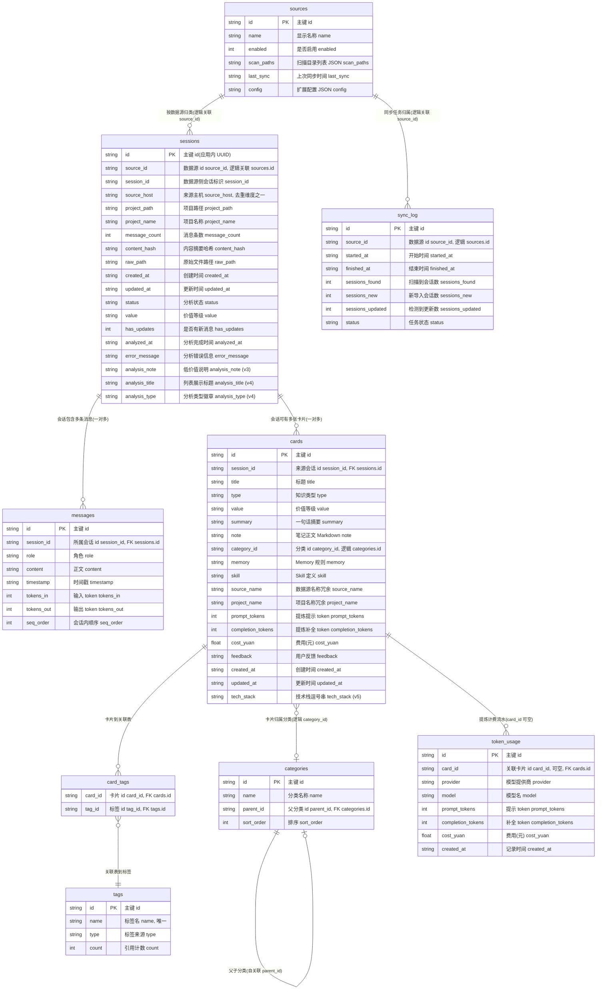

# 寻迹（XunJi）SQLite 数据模型与表关系

本文档描述桌面端（Tauri）本地库当前 Schema，依据 `apps/desktop/src-tauri/src/storage/migrations.rs` 中的迁移逻辑整理，并用 Mermaid 辅助说明实体关系。

## 1. 概述

| 项目 | 说明 |
|------|------|
| 引擎 | SQLite，连接时开启 `PRAGMA foreign_keys=ON`、`journal_mode=WAL` |
| 默认路径 | `~/.xunji/db/xunji.db`（见应用配置） |
| 版本 | `PRAGMA user_version`，当前迁移最高为 **v6** |
| 权威来源 | `storage/migrations.rs`（DDL）+ `storage/models.rs`（Rust 结构体与业务语义） |

**外键策略**：仅在 `messages`、`cards`、`card_tags`、`categories`（自关联）、`token_usage` 上声明 SQLite `FOREIGN KEY`。`sessions.source_id`、`sync_log.source_id`、`cards.category_id` 等在库中为**逻辑关联**，应用层负责一致性，便于数据源与分类的灵活演进。

---

## 2. 实体关系图（ER）

下列图中标注「逻辑」的连线在数据库中**没有** `FOREIGN KEY` 约束。

**图例**：字段类型在图中使用 Mermaid 支持的写法（`string` / `int` / `float`），与 SQLite 的 `TEXT` / `INTEGER` / `REAL` 一一对应；字段行尾双引号内为「中文说明 + 英文字段名」。  
**说明**：部分预览器对 `erDiagram` 的 `实体["别名"] { ... }` 或 SQL 风格类型名解析不兼容，会导致实体框只显示 “(no attributes)”。下图使用**纯表名 + 标准类型**，以保证属性能渲染；中文表名见下表。

| 表名 `identifier` | 中文含义 |
|---------------------|----------|
| `sources` | 数据源 |
| `sessions` | 会话 |
| `messages` | 对话消息 |
| `cards` | 知识卡片 |
| `tags` | 标签 |
| `card_tags` | 卡片与标签关联（多对多） |
| `categories` | 分类 |
| `sync_log` | 同步日志 |
| `token_usage` | Token 用量 / 计费流水 |



**字段名说明**：`tags` 表中业务列在 SQLite 里名为 `type`；Mermaid 属性名若使用 `type` 易与语法关键字冲突，图中写作 `tag_type`，并在注释中标明「列名 type」。

---

## 3. 关系说明（业务视角）

```text
sources（数据源）
    │ source_id（逻辑）
    ├── sessions（会话，去重键：session_id + source_host UNIQUE）
    │       ├── messages（对话消息）
    │       └── cards（知识卡片）
    │               ├── card_tags ── tags（标签，多对多）
    │               └── token_usage（提炼费用，可关联卡片）
    └── sync_log（同步任务日志）

categories（分类树，自引用 parent_id）

cards_fts（FTS5 虚拟表，见下节，非业务实体表）
```

- **会话去重**：同一数据源侧 `session_id` 在不同 `source_host` 下可共存；组合 `(session_id, source_host)` 唯一。
- **卡片与标签**：标签名在 `tags.name` 上唯一；`card_tags` 为联合主键 `(card_id, tag_id)`。
- **全文搜索**：`cards_fts` 为 FTS5 独立索引表，字段 `title, summary, note, tags`；`tags` 列内容由 `card_tags` + `tags` 拼接后写入，与 `cards` 表无 `content=` 回链（见迁移 v2 说明）。

---

## 4. 各表字段概要

### 4.1 `sources`

AI IDE 数据源配置（名称、启用、扫描路径 JSON、上次同步时间、扩展配置 JSON）。

### 4.2 `sessions`

一条记录对应一次采集到的 AI 对话（如一个 JSONL 文件）。含分析流水线字段：`status`、`value`、`analyzed_at`、`error_message`；v3/v4 起增加低价值会话展示用 `analysis_note`、`analysis_title`、`analysis_type`。

### 4.3 `messages`

会话内消息，`seq_order` 为会话内顺序；`role` 如 user / assistant / tool 等。

### 4.4 `cards`

由 LLM 从会话提炼的笔记；`type` / `value` 等为业务枚举字符串；`tech_stack`（v5）为逗号分隔技术栈字符串；展示用标签来自关联查询，非 `cards` 表列。

### 4.5 `tags` / `card_tags`

标签字典与卡片—标签多对多桥表。

### 4.6 `categories`

分类树，`parent_id` 指向同表（可为空表示根）。

### 4.7 `sync_log`

某次同步任务的统计与状态，按 `source_id` 与数据源对应（逻辑关联）。

### 4.8 `token_usage`

LLM 调用计费流水；`card_id` 可空，声明外键指向 `cards(id)`。

### 4.9 `cards_fts`（虚拟表）

FTS5，用于卡片侧栏/列表等全文检索；应用层在卡片写入、更新、删除及标签变更时维护与 `cards` 一致。

---

## 5. 迁移版本与 Schema 增量

| 版本 | 内容摘要 |
|------|----------|
| v1 | 创建全部业务表、`cards_fts`、索引 |
| v2 | 重建 `cards_fts` 为独立 FTS5，并从现有 `cards` + 标签关联回填 |
| v3 | `sessions.analysis_note` |
| v4 | `sessions.analysis_title`、`sessions.analysis_type` |
| v5 | `cards.tech_stack` |
| v6 | 数据修复：解码 `sessions` 中仍含 URL 编码的 `project_path` / `project_name` |

执行顺序见 `run()`：按 `user_version` 递增直至当前最高版本。

---

## 6. 代码索引

| 模块 | 路径 |
|------|------|
| 迁移 DDL | `apps/desktop/src-tauri/src/storage/migrations.rs` |
| 模型与注释 | `apps/desktop/src-tauri/src/storage/models.rs` |
| 连接与错误类型 | `apps/desktop/src-tauri/src/storage/db.rs` |

文档随迁移变更时请同步更新本文与 `CHANGELOG`（若项目约定记录 Schema 变更）。
